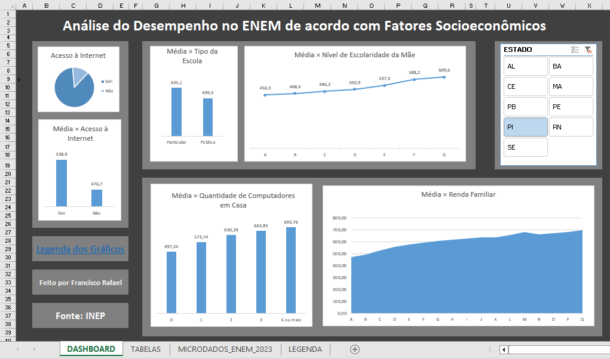

# Dashboard de Microdados do ENEM

Projeto em Excel com Power Query para análise exploratória dos microdados do ENEM.

## 📌 Contexto

- Inspirado por um trabalho da disciplina de **Probabilidade e Estatística**  
- Objetivo inicial: calcular **média** e **desvio padrão** dos participantes de acordo com os fatores socioeconômicos
- Evoluiu para um dashboard com **tratamento de dados** (como a remoção de alunos ausentes) e **análises interativas** por estado selecionado

## ⚙️ Ferramentas Utilizadas

- Microsoft Excel  
- Power Query  
- Tabelas e Gráficos Dinâmicos  

## 📁 Arquivo

- Tamanho: **91 MB**  
- Disponível no Google Drive:  
  👉 [Download do Dashboard ENEM (Excel)](https://drive.google.com/drive/folders/19JVA7N-5bC5x6KiOXQVjfBg3p1jgYA_D?usp=drive_link)

## 🖼️ Imagem do Dashboard

## 📊 Seções do Dashboard

- **Visão Geral**  
  Número total de participantes e filtros por estado, sexo, etc.

- **Acesso à Internet**  
  - % de participantes com e sem acesso  
  - Média de desempenho:  
    - Com acesso  
    - Sem acesso  

- **Tipo de Escola**  
  - Média:  
    - Escola pública  
    - Escola particular  

- **Escolaridade da Mãe**  
  - Comparação da média conforme o grau de instrução da mãe  

- **Renda e Computadores**  
  - Médias por:  
    - Faixa de renda familiar  
    - Quantidade de computadores em casa  

## ✅ Conclusão

- As **melhores médias** são observadas entre estudantes com:  
  - **Escola particular**  
  - **Acesso à internet**  
  - **Maior escolaridade da mãe**  
  - **Maior renda familiar**  
  - **Maior número de computadores em casa**  

> *(Essas conclusões se mantêm independentemente do estado selecionado.)*
